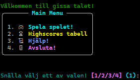
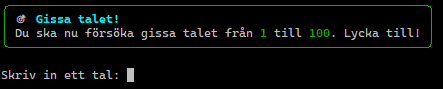
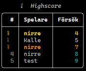

# 🎯 Gissa Numret!

<p align="center">
  
  
  
  
</p>

```
 ██████╗ ██╗███████╗███████╗ █████╗     ███╗   ██╗██╗   ██╗███╗   ███╗██████╗ ███████╗████████╗██╗
██╔════╝ ██║██╔════╝██╔════╝██╔══██╗    ████╗  ██║██║   ██║████╗ ████║██╔══██╗██╔════╝╚══██╔══╝██║
██║  ███╗██║███████╗███████╗███████║    ██╔██╗ ██║██║   ██║██╔████╔██║██████╔╝█████╗     ██║   ██║
██║   ██║██║╚════██║╚════██║██╔══██║    ██║╚██╗██║██║   ██║██║╚██╔╝██║██╔══██╗██╔══╝     ██║   ╚═╝
╚██████╔╝██║███████╗███████║██║  ██║    ██║ ╚████║╚██████╔╝██║ ╚═╝ ██║██║  ██║███████╗   ██║   ██╗
 ╚═════╝ ╚═╝╚══════╝╚══════╝╚═╝  ╚═╝    ╚═╝  ╚═══╝ ╚═════╝ ╚═╝     ╚═╝╚═╝  ╚═╝╚══════╝   ╚═╝   ╚═╝ 
```

Ett roligt **textbaserat nummer-gissarspel** i Python. Gissa rätt tal på så få försök som möjligt! Spelet ger ledtrådar och sparar dina resultat i en **highscore-tabell** kopplad till din spelare.

---

## Innehåll

* [Funktioner](#funktioner)
* [Teknisk översikt](#teknisk-översikt)
* [Bibliotek](#Bibliotek)
* [Kom igång – installation](#kom-igång--installation)

  * [Windows (PowerShell)](#windows-powershell)
  * [macOS & Linux](#macos--linux)
  * [Snabbstart utan virtuell miljö](#snabbstart-utan-virtuell-miljö)
* [Köra spelet](#köra-spelet)
* [Mappstruktur](#mappstruktur)
* [Exempel (terminal)](#exempel-terminal)
* [Tester](#tester)
* [Team](#team)
* [Framtida förbättringar](#framtida-förbättringar)
* [Licens / användning](#licens--användning)

---

## Funktioner

* 🔢 Slumpar fram ett hemligt nummer
* 💬 Ledtrådar: *för högt*, *för lågt*, *du är nära*
* ⏱️ Räknar antal försök (lägre = bättre placering)
* 👤 Skapa & spara **spelare** för återkommande spel
* 🏆 **Highscore** sparas och kan visas i spelet
* 💾 Data lagras i JSON-filer under `data/`
* 🧩 Ren objektorienterad design (klasser & moduler)

---

## Teknisk översikt

**Kodspråk:** Python (körs via terminal/CLI)

**Centrala moduler/klasser:**

* `modules/game.py` – spel-loop och logik
* `modules/player.py` – spelare (namn, historik)
* `modules/highscore.py` – highscore-hantering
* `modules/get_number.py` – felhantering/validering av gissningar
* `modules/clear.py` – rensa terminalen (OS-anpassat)
* `~/main.py` - start-meny samt länkar ihop allt

**Datafiler:**

* `data/highscore.json` – toplista
* `data/users.json` – registrerade spelare

> 📦 Startfil: **`run.py`** (startar spelet)

---

## 📚 Bibliotek

**Standardbibliotek:**

* `random` - används för att slumpa fram det hemliga talet
* `json` - sparar och läser highscore-data
* `os` - används för terminalrensning och filvägar
* `__future__` - för framåtkompatibilitet mellan Python-versioner
* `pathlib` - hanterar fil- och sökvägar på ett portabelt sätt

**Externa bibliotek:**

* `rich` - används för en mer färgglad och tydlig CLI-upplevelse

---

## Kom igång – installation

Förutsätter att **Python 3.10+** är installerat. Rekommenderat är att använda en **virtuell miljö** (`venv`).

### Windows

```powershell
# Klona projektet
git clone <repo-url>
cd AIDEV-grupp1

# Skapa & aktivera virtuell miljö
py -m venv .venv
source .venv\Scripts\Activate

# Installera
pip install -r requirements.txt
```

### macOS & Linux

```bash
# Klona projektet
git clone <repo-url>
cd AIDEV-grupp1

# Skapa & aktivera virtuell miljö
python3 -m venv .venv
source .venv/bin/activate

# Installera
pip install -r requirements.txt
```

---

## Köra spelet

**Starta spelet** (välj kommando som passar din miljö):

* Windows:

  ```powershell
  py run.py
  ```
* macOS & Linux:

  ```bash
  python3 run.py
  ```

> Alternativt kan `python` fungera på alla plattformar beroende på din installation:
>
> ```bash
> python run.py
> ```

**Vanliga problem:**

* Får du fel om *moduler*? Kontrollera att du kör kommandot **i projektets rotmapp** (`AIDEV-grupp1/`).

---

## Mappstruktur

```
/AIDEV-grupp1/
    ├─ /data/
    │   ├─ highscore.json
    │   └─ users.json
    ├─ /docs/
    │    └─/img/
    │        ├─ game.png
    │        ├─ highscore.png
    │        └─ main.png
    ├─ /modules/
    │   ├─ __init__.py
    │   ├─ clear.py
    │   ├─ game.py
    │   ├─ get_number.py
    │   ├─ highscore.py
    │   └─ player.py
    ├─ /tests/
    │   ├─ __init__.py
    │   ├─ test_game.py
    │   ├─ test_highscore.py
    │   └─ test_main.py
    ├─ /ui/
    │   └─ highscore_ui.py
    ├─ /utilities/
    │   └─ __init__.py
    ├─ main.py
    ├─ README.md
    ├─ requirements.txt
    └─ run.py
```

---

## 📸 Exempel (terminal)







---

## Tester

Kör tester med **pytest** (om inkluderat i `requirements.txt`):

```bash
# I aktiv venv
pytest -q
```

---

## Team

| Namn             | GitHub                                                     | Ansvar                     |
| ---------------- | ---------------------------------------------------------- | -------------------------- |
| Constantine      | [@AeolianOpus](https://github.com/AeolianOpus)             | `main.py`, `player.py`, bugg-fixar      |
| Nicklas        | [@nicklasskoglund](https://github.com/nicklasskoglund)     | `highscore.py`, `highscore_ui.py`, `README.md`,  bugg-fixar |
| Ali              | [@aliizarifiii-cell](https://github.com/aliizarifiii-cell) | `player.py`, bugg-fixar    |
| Anton            | [@Aeontonn](https://github.com/Aeontonn)                   | `game.py`, `get_number.py`, `clear.py`, bugg-fixar      |

---

## Framtida förbättringar

* [ ] Olika svårighetsgrader (t.ex. intervall 1–50 / 1–100 / 1–1000)
* [ ] Webbbaserad version (Flask)
* [ ] Publikt API för highscore
* [ ] GUI (t.ex. Tkinter eller PyQt)
* [ ] Persistens med SQLite i stället för JSON

---

## Licens / användning

Detta repo är skapat som en **skoluppgift**. Använd fritt i utbildningssyfte. Vill du bygga vidare – kör! 💪
